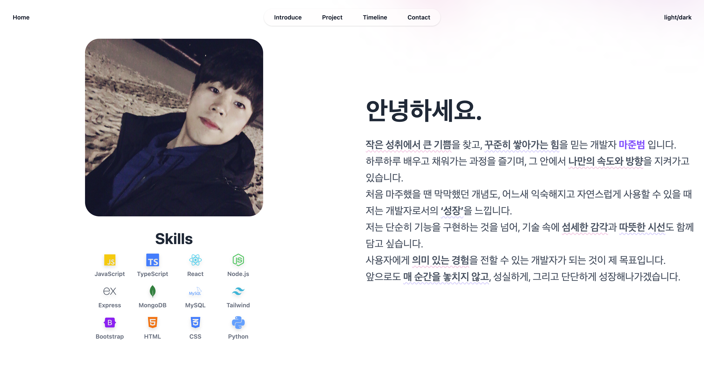

# JB-Portfolio



---

## 🛠️ 기술스택

- **Frontend**: React, TypeScript, Tailwind CSS
- **Build Tool**: Vite
- **Animation**: Framer-Motion, GSAP, Lottie
- **배포**: Vercel
- **기타**: React-Icons

---

## ⏰ 제작 기간

- 2025.05.23 ~ 2025.05.27 (5일)

---

## 📁 폴더 구조

```
├── eslint.config.js         // ESLint 설정 파일
├── index.html               // 앱 진입점 HTML
├── package-lock.json        // npm 패키지 lock 파일
├── package.json             // 프로젝트 메타/의존성 정보
├── public
│   ├── Aboutme
│   │   └── MJB.JPG          // 자기소개 이미지
│   ├── animations
│   │   ├── ContactAnimation.json // Lottie 애니메이션
│   │   └── projectImg
│   └── projectImg
│       ├── ankara_messi.png     // 프로젝트 이미지
│       ├── Photo-Gallery.png
│       └── Portfolio.png
├── README.md                 // 프로젝트 설명 문서
├── src
│   ├── App.css
│   ├── App.tsx               // 앱 루트 컴포넌트
│   ├── assets
│   ├── component             // UI 컴포넌트 모음
│   │   ├── About.tsx         // 자기소개(About) 섹션 컴포넌트
│   │   ├── Contact.tsx       // 연락처(Contact) 섹션 컴포넌트
│   │   ├── Header.tsx        // 상단 네비게이션 헤더
│   │   ├── Hero.tsx          // 메인 인트로 Hero 섹션
│   │   ├── Introduce.tsx     // 상세 자기소개 및 스킬/이미지 영역
│   │   ├── IntroTyping.tsx   // 타이핑 애니메이션 컴포넌트
│   │   ├── LottiePlayer.tsx  // Lottie 애니메이션 재생 컴포넌트
│   │   ├── Project.tsx       // 개별 프로젝트 카드/섹션
│   │   ├── Projects.tsx      // 프로젝트 리스트(전체) 섹션
│   │   ├── R_Project.tsx     // 역방향 개별 프로젝트 섹션
│   │   ├── Skills.tsx        // 기술스택(아이콘 등) 표시 컴포넌트
│   │   └── Timeline.tsx      // 타임라인 컴포넌트
│   ├── data
│   │   └── data.ts          // 프로젝트 데이터
│   ├── index.css            // Tailwind 등 전역 스타일
│   ├── main.tsx             // 앱 진입점
│   ├── pages
│   │   └── DetailProject.tsx // 프로젝트 상세 페이지
│   └── vite-env.d.ts        // Vite 타입 정의
├── tsconfig.app.json        // 앱용 TypeScript 설정
├── tsconfig.json            // 전체 TypeScript 설정
├── tsconfig.node.json       // Node.js용 TypeScript 설정
└── vite.config.ts           // Vite 빌드/개발 서버 설정
```

---

## ⚛️ 왜 리액트+타입스크립트로 포트폴리오를 만들었나? (React의 장점)

- **컴포넌트 기반 아키텍처**: UI를 독립적이고 재사용 가능한 컴포넌트 단위로 분리하여 개발할 수 있어, 유지보수성과 확장성이 뛰어납니다. 각 기능별 컴포넌트를 조합해 복잡한 화면도 효율적으로 구성할 수 있습니다.
- **Virtual DOM을 통한 고성능 렌더링**: React는 Virtual DOM을 활용해 실제 DOM 변경을 최소화하고, 변경 사항만 효율적으로 반영하여 빠른 렌더링 성능을 제공합니다.
- **풍부한 생태계와 라이브러리**: Framer Motion, GSAP, Lottie 등 다양한 서드파티 라이브러리와의 연동이 용이하며, 방대한 커뮤니티와 자료 덕분에 개발 생산성이 높습니다.
- **SPA(Single Page Application)**: 페이지 전환 시 전체 리로드 없이 필요한 부분만 동적으로 갱신되어, 부드럽고 빠른 사용자 경험을 제공합니다.
- **TypeScript와의 강력한 시너지**: 타입 안정성과 생산성을 동시에 챙길 수 있습니다.

---

## ⚠️ 트러블 슈팅

- **Intersection Observer와 애니메이션 중첩 문제**  
  → 빠르게 스크롤할 때 observer와 setTimeout이 꼬여서 애니메이션이 중복 실행되는 현상이 있었음.  
  → cleanup 함수에서 clearTimeout, observer.disconnect()를 철저히 관리하여 해결.

- **이미지 경로 문제 (Vercel 배포 시)**  
  → GitHub에서 Vercel로 배포할 때 이미지 경로가 잘못되어 에러 발생.
  → 경로의 중요성을 깨닫고, `public` 폴더 내에 이미지 파일을 위치시키고 폴더 대소문자 구분을 철저히 하여 해결.

- **타이핑 애니메이션 상태 꼬임**  
  → 화면을 빠르게 벗어났다 들어올 때 상태가 꼬이는 현상 발생.  
  → 상태 초기화와 setTimeout 클리어를 useEffect에서 확실히 처리하여 해결.

- **반응형 레이아웃 이슈**  
  → 텍스트 영역이 너무 넓어져 가독성이 떨어지는 문제  
  → max-width, 비율 기반 width 등으로 일관성 있게 조정

---

## 🚀 향후 기능 추가 계획

- 다크모드/라이트모드 토글
- 프로젝트별 상세 페이지에 이미지 슬라이더
- 프로젝트 상세페이지 UI 개선
- 타임라인 모바일UI 및 반응형 디자인 개선
- Hero 섹션 텍스트 개선
- 폰트 변경

---

> 궁금한 점이나 제안이 있다면 언제든 이슈/PR 남겨주세요!
>
> **배포 주소:** [https://my-portfolio-pi-topaz-10.vercel.app/](https://my-portfolio-pi-topaz-10.vercel.app/)
